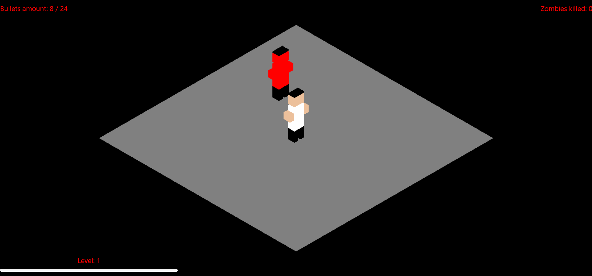
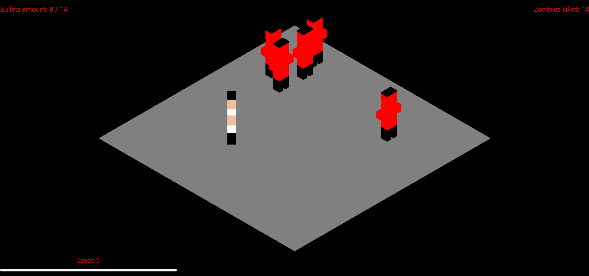
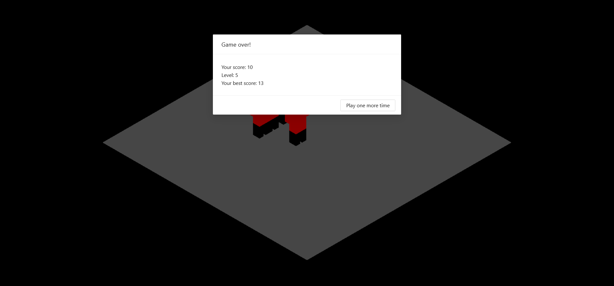

# Zombie shooter game
> Demo available here: http://estewui.github.io/shooter

## Table of contents
* [General info](#general-info)
* [Technologies](#technologies)
* [Setup](#setup)
* [Screenshots](#screenshots)
* [Status](#status)
* [Contact](#contact)

## General Info

Shooter game, created as part of "3D Graphics" classes.

## Technologies

Project is created with:
* React 17 
* Three.js

## Setup

Clone this repo. You need `npm` to run this app.
Install project locally using npm:

```
$ npm install
$ npm start
```
Project will run on port 3000.

## Screenshots





## Status
Project is: finished

## Contact
Created by [@estewui](https://www.linkedin.com/in/stanis%C5%82aw-t%C4%99czy%C5%84ski-007153188/) - feel free to contact me!
